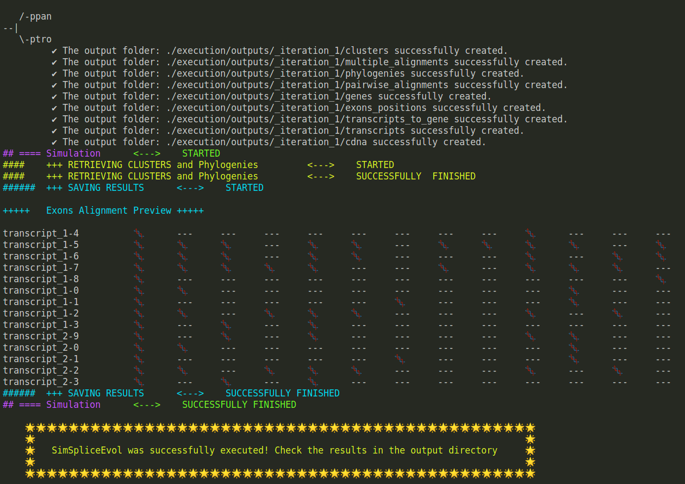

# :computer: SimSpliceEvol2: alternative splicing-aware simulation of biological sequence evolution and transcript phylogenies.

<!-- OVERVIEW -->
<h3 id="overview"> Overview </h3>

`SimSpliceEvol is a tool designed to simulate the evolution of sets of alternative transcripts along the branches of an input gene tree. In addition to traditional sequence evolution events, the simulation also incorporates events related to the evolution of gene exon-intron structures and alternative splicing. These events modify the sets of transcripts produced from genes. Data generated using SimSpliceEvol is valuable for testing spliced RNA sequence analysis methods, including spliced alignment of cDNA and genomic sequences, multiple cDNA alignment, identification of orthologous exons, splicing orthology inference, and transcript phylogeny inference. These tests are essential for methods that require knowledge of the real evolutionary relationships between the sequences.`

<p align="center">
    
</p>
<!--<p align="center">
  
  
</p>>

> :busts_in_silhouette: __Authors__* `Esaie Kuitche , Safa Jammali and Aïda Ouangraoua`, CoBIUS LAB, Department of Computer Science, Faculty of Science, Université de Sherbrooke, Sherbrooke, Canada*

> :bulb: If you use our tool in your research, please cite our paper: `Kuitche, E., Jammali, S. & Ouangraoua, A. SimSpliceEvol: alternative splicing-aware simulation of biological sequence evolution. BMC Bioinformatics 20, 640 (2019).`

> :e-mail: `Contact: wend.yam.donald.davy.ouedraogo@usherbrooke.ca`

<!-- TABLE OF CONTENTS -->
<h2 id="table-of-contents"> :book: Table of Contents</h2>


1. [➤ Overview](#overview)
2. [➤ Operating System](#os)
3. [➤ Requirements](#requirements)
4. [➤ Graphical User Interface (GUI) and Webserver](#package)
5. [➤ Getting Started](#getting-started)
6. [➤ Main Command - Execution](#main)
7. [➤ Descriptions of Project Files](#project-files-description)
    1. [➤ Description of Inputs](#project-files-description-inputs)
    2. [➤ Description of Outputs](#project-files-description-outputs)


<!-- Operating System -->
<h3 name="os"> :man_technologist: Operating System</h3>
The program was both developed and tested on a system operating Ubuntu version 18.04.6 LTS.


<!-- Requirements -->
<h3 id="requirements"> :hammer_and_pick: Requirements</h3>

*   __`python3 (at leat python 3.6)`__
*   __`ETE toolkit (ete3)`__
*   __`networkx`__
*   __`pyQt5`__
*   __`timeout_decorator`__
*   __`Pandas`__
*   __`Numpy`__


<!--- Note: All theses requirements are installed with the Pypi package --->


<!-- Package -->
<h3 id="package"> :package: Graphical User Interface (GUI) and Webserver</h3>

> Unzip the file ``application.zip`` and access the GUI ``simspliceevolv2GUI`` in the application folder..

>>> ⚠️ It may take some time (not more than 15 seconds) to launch the program due to deploying the environment and the necessary modules to compute the program successfully. If any errors occur, feel free to contact us.

> The webserver and the GUI are available at [``https://simspliceevol.cobius.usherbrooke.ca/``](https://simspliceevol.cobius.usherbrooke.ca/)


<!-- Getting started -->
<h2 id="getting-started"> :rocket: Getting Started</h2>

<!-- Main Command -->
<h3 id="main"> :computer: Main Command</h3>

> Command

<pre><code> usage: simspliceevolv2.py [-h] -i INPUT_TREE_FILE [-it ITERATIONS]
                          [-dir_name DIRECTORY_NAME] [-eic_el EIC_EL]
                          [-eic_ed EIC_ED] [-eic_eg EIC_EG] [-c_i C_I]
                          [-c_d C_D] [-k_nb_exons K_NB_EXONS] [-k_eic K_EIC]
                          [-k_indel K_INDEL] [-k_tc K_TC]
                          [-tc_a5 ALTERNATIVE_FIVE_PRIME]
                          [-tc_a3 ALTERNATIVE_THREE_PRIME]
                          [-tc_es EXON_SKIPPING] [-tc_me MUTUALLY_EXCLUSIVE]
                          [-tc_ir INTRON_RETENTION] [-tc_tl TRANSCRIPT_LOSS]</code></pre>

> Usage example

___(Note: We preserved the default settings/parameters for the next example and we redirected the output of our simulation to the directory ./execution/outputs)___

<pre><code> python3 simspliceevolv2.py -dir_name 'execution/outputs' -i 'execution/inputs/small_example.nw' </code></pre>

> Expected output


<p align="center">
    
</p>


<h2 id="project-files-description"> :file_folder: Description of Project Files/Arguments </h2>


<h3 id="project-files-description-inputs"> :keyboard: Description of Inputs </h3>

>__REQUIRED FILE__ 

The only required file is the Newick file `[-i INPUT TREE_FILE]`,which must contain the length of branches (NHX format is also accepted).

> __OPTIONAL ARGUMENTS__

The other arguments are optional, and we describe them below:

`[-it ITERATION]` name of the simulation (default='1')

`[-k_nb_exons K_NB_EXONS]` multiplicative constant for number of exons in gene (default =1.5)

`[-k_eic K_EIC]` multiplicative constant for exon-intron change (eic) rate (default=25)

`[-k_indel K_INDEL]`  multiplicative constant for codon indel rate (default= 5)

`[-k_tc K_TC]` multiplicative constant for transcript change (default=10)

`[-eic_el EIC_EL]` relative frequence of exon-intron structure change by exon loss (default=0.4)

`[-eic_eg EIC_EG]` relative frequence of exon-intron structure change by exon gain (default=0.5)

`[-eic_ed EIC_ED]` relative frequence of exon-intron structure change by exon duplication (default=0.1)

`[-c_i C_I]` relative frequence of codon insertions (default=0.7)

`[-c_d C_D]` relative frequence of codon deletions (default=0.3)

`[-tc_a5 ALTERNATIVE_FIVE_PRIME]` relative frequence of alternative five prime in tc (default =0.25)

`[-tc_a3 ALTERNATIVE_THREE_PRIME]` relative frequence of alternative three prime in tc (default =0.25)

`[-tc_es EXON_SKIPPING]` relative frequence of exon skipping in tc (default=0.35)

`[-tc_me MUTUALLY_EXCLUSIVE]` relative frequence of mutually exclusive in tc (default =0.15)

`[-tc_ir INTRON_RETENTION]` relative frequence of intron retention in tc (default=0.00)

`[-tc_tl TRANSCRIPT_LOSS]` relative frequence of transcript loss in tc (default=0.3)

<h3 id="project-files-description-outputs"> :minidisc: Description of Outputs</h3>

__Outputs files__ 

SimSpliceEvol creates nine(9) folders.

> [output_directory]/genes/[_iteration_#i]

- The file **genes.fasta** contains all the gene sequences in FASTA format.

> [output_directory]/transcripts/[_iteration_#i]

- The file **transcripts.fasta** contains all the transcript sequences in FASTA format.

> [output_directory]/transcripts_to_gene/[_iteration_#i]

- The file **mappings.txt** contains all the transcript IDs along with their corresponding genes.

> [output_directory]/pairwise_alignments/[_iteration_#i]

- The file **pairwise_alignments.fasta** contains all the spliced alignments of transcripts with their corresponding gene sequences in FASTA format.

> [output_directory]/multiple_alignments/[_iteration_#i]

- The file **msa_transcripts.alg** contains the multiple sequence alignment of transcripts in FASTA format.

- The file **splicing_structure.csv** describes the representation of exons in CSV format.

> [output_directory]/exons_positions/[_iteration_#i]

- The file **exons_positions.txt** contains the positions(start and end) of exons in transcripts and genes.

> [output_directory]/clusters/[_iteration_#i]

- The file **ortholog_groups.clusters** describes the clusters of orthologous transcripts(transcripts with the same structure). A cluster can induce recent paralogs or isoorthologs.

> [output_directory]/phylogenies/[_iteration_#i]

- The **svg images** and **newick files** contained in the directory describe the evolutionary history of transcripts. (For further exploration, refer to the section below)

   - Nodes 

        - leaves
      
            * <span style="color:gold"> *gold* </span>: transcripts of existing genes.

            * <span style="color:gray"> *gray* </span>: transcripts of ancestral genes.
        
        - internal nodes

            * <span style="color:red"> *red* </span>: Intron Retention (IR)

            * <span style="color:orange"> *orange* </span>: Mutually Exclusive exons (ME)

            * <span style="color:violet"> *violet* </span>: 5 prime Splice Site (5SS)

            * <span style="color:mediumblue"> *medium blue* </span>: 3 prime Splice Site (3SS)

            * <span style="color:limegreen"> *lime green* </span>: Exon Skipping (ES)

            * <span style="color:white"> *white* </span>: Conservation (Speciation or Duplication event under the LCA-reconciliation), i.e., not a creation event.

        ```
```diff
+ Example`.
```
<p align='center' style="background-color:gray;padding:20px;">
    
</p>


```diff
! two ME nodes 
# (orange internal nodes)

! one 5SS node
# (violet internal node)

! conservation nodes
# (white internal nodes)

! transcript in existing genes
# (gold leaves'nodes)

! ancient transcripts
# (gray leaves'nodes)

```

__MORE with SimSpliceEvol__

The main function ```simspliceevol()```

> simspliceevol(SRC, ITERATION_NAME, TREE_INPUT, K_NB_EXONS, K_INDEL, C_I, C_D, EIC_ED, EIC_EG, EIC_EL, K_EIC, K_TC, TC_RS, TC_A3, TC_A5, TC_ME, TC_ES, TC_IR, TC_TL)

returns a set that contains:
-   an ``ETE tree python object`` as presented in the library ___ete3___ .  Each node possesses attributes used to provide additional details about the simulation.
-   a ``pandas DataFrame`` with data containing exons sequences, indexed by the names of transcripts, and columns representing exons.

After a simulation, each tree node has two types of attributes: one describing the evolution of genes and the other describing the evolution of transcripts.

``` GENE EVOLUTION ```
<table border="1">
    <tr>
        <th>METHOD</th>
        <th>DESCRIPTION</th>
    </tr>
    <tr>
        <td>TreeNode.gene_name</td>
        <td>returns the name of the gene.</td>
    </tr>
    <tr>
        <td>TreeNode.gene_stucture</td>
        <td>returns a description of the gene's structure. This is an ordered list showing the alteration of exons and introns.</td>
    </tr>
    <tr>
        <td>TreeNode.exons_dict</td>
        <td>stores the exons of the gene and their sequences. The sequence depicts codon substitutions and indel evolution, represented by *** in the sequence.</td>
    </tr>
    <tr>
        <td>TreeNode.introns_dict</td>
        <td>stores the introns of the gene and their sequences.</td>
    </tr>
</table>

``` TRANSCRIPT EVOLUTION ```

<table border="1">
    <tr>
        <th>METHOD</th>
        <th>DESCRIPTION</th>
    </tr>
    <tr>
        <td>TreeNode.transcripts_dict</td>
        <td>stores transcripts of the gene node and the description of their structure.</td>
    </tr>
    <tr>
        <td>TreeNode.transcripts_sequences_dicts</td>
        <td>stores the sequences of exons.</td>
    </tr>
</table>


Copyright © 2023 CoBIUS LAB
